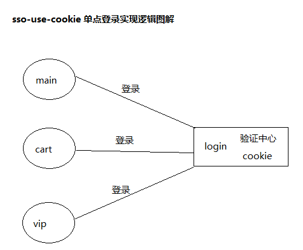

#### 使用cookie实现单点登录（学习项目）

##### 视频链接：https://www.bilibili.com/video/av49230189/?p=15

##### 1. 全局概览：

##### 2. 图片解析：

main、cart、vip以及login都是独立的子系统，当用户想要访问前三个子系统时，都需要登录，所以需要向login子系统发起登录请求，而login子系统会先对第一次登录的用户做一些校验(模拟数据库中是否存在该用户)，
然后将其保存在cookie中，当其他子系统也发起登录请求的时候，login子系统提供了一个接口判断之前是否有用户已经登录，若有，则直接通过验证，这样就达到了一个使用cookie实现单点登录的功能。

##### 3. 实现细节：
    3.1 cart、vip、main系统首页各自提供一个“登录”跳转a链接，用于向login系统发起登录请求。
    3.2 login系统提供了两个处理请求的控制器，ViewController和LoginController，前者专门用来做页面跳转的，后者才是真正做登录验证的。
    3.3 由于上面的“登录”链接是一个a链接，请求的方式为get请求，因此ViewController控制器处理请求方法的映射注解也只能是@GetMapping。
    3.4 从页面跳转控制器跳转到login登录页面，提交表单信息后才跳转到LoginController做登录验证，此时登录请求的方式为post请求，处理请求方法的映射注解是@PostMapping。
    3.5 LoginController拿到表单提交的用户信息后，做了用户名、密码的非空校验，用户在模拟数据库中是否存在，若满足登录条件则验证通过，将此次登录的用户信息保存到cookie中。
    3.6 重点来了，是如何将用户保存到cookie中的？首先为用户提供一个token，token就是用于标识用户的一个凭证，就像人的身份证号一样，然后创建cookie对象，将token和用户保存起来。
    3.7 这样，只要有一个子系统登录了，其他子系统登录的时候就会直接成功登录了。

##### 4. 问题记录：
    4.1 为什么很多系统都提供一个页面跳转的控制器（ViewController），有啥好处？
    4.2 “登录”链接是get请求，而不能是post请求，如何改成post请求？
    4.3 该学习项目进行到P12节出现问题，没有实现视频中用户登录过一次后，再次点击登录链接不能跳转到登录页面的效果，检查原因估计是用户第一次登录后设置cookie值出现问题（LoginController类里面）。
    
##### 5. 总结：
要实现单点登录最关键的就是将登录用户信息保存到cookie中，其他子系统登录的时候通过一个接口拿到已登录的用户信息，直接登录成功。

    